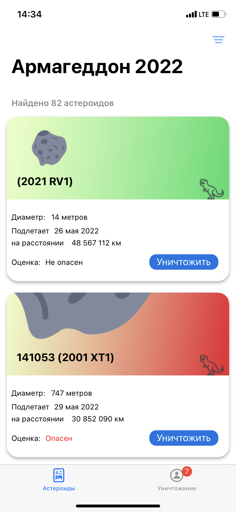
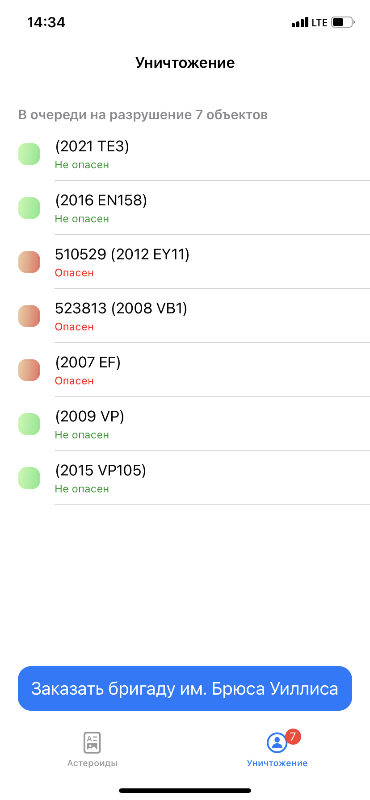

# Armageddon-2022

Данные по астероидам запрашиваются с api "https://api.nasa.gov/", а после сохраняются в базу данных.
В таблице есть кнопка уничтожения, тапнув по которой астероид попадает в очередь на уничтожение. 
При вызове "Бригады" на уничтожение воспроизводится кусочек из трейлера к фильму "Армагеддон".

В проекте использовал: 
- Realm, 
- Многопоточность DispatchQueue
- Сетевой слой URLSession

Для сборки вам потребуется: 
pod 'RealmSwift', '~>10'

 
